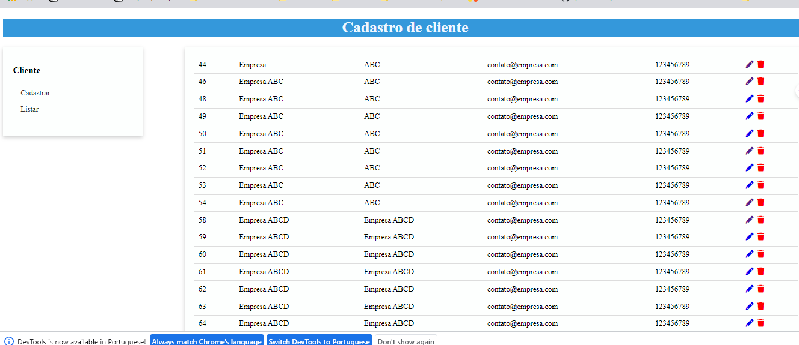

# Crud-cliente

<!---Esses são exemplos. Veja https://shields.io para outras pessoas ou para personalizar este conjunto de escudos. Você pode querer incluir dependências, status do projeto e informações de licença aqui--->




> Aula  PHP,MYSQL,jQUERY.

### Ajustes e melhorias

tarefas:

- [x] Montagem do ambiente  no windows
- [x] criação da crud com PHP,Jquery e Mysql
- [x] montar o ambiente no linux
- [x] corrigir a função inserir cliente
- [ ] refazer a crud com um microframework
- [ ] refazer um API em laravel e  consumir com Jequery e Ajax
  [ ]

## 💻 Pré-requisitos

Antes de começar, verifique se você atendeu aos seguintes requisitos:
<!---Estes são apenas requisitos de exemplo. Adicionar, duplicar ou remover conforme necessário--->
* Você instalou a versão mais recente de `<linguagem / dependência / requeridos>`
* Você tem uma máquina `<Windows / Linux / Mac>`. Indique qual sistema 
## 🚀 Instalando ambiente no windows 
Para montar o ambiente no windows, siga estas etapas:

Windows:
  1. instalação do Laragon 
  2. instalação  do MYSQL 
  3. instalação do vscode
  4. instalar plugin mysql no vscode
  

Linux :
 1. instalação do PHP 
 2. instalação do apache
 3. instalação do mysql
 4. configuração do mysql
 3. Habilitar modo de autenticação do MYSQL antiga no linux para logar com phpMyadmin


## ☕ Usando crud-cliente>

Para usar <nome_do_projeto>, siga estas etapas:

```
<exemplo_de_uso>
```

Adicione comandos de execução e exemplos que você acha que os usuários acharão úteis. Fornece uma referência de opções para pontos de bônus!

## 📫 Contribuindo para <nome_do_projeto>
<!---Se o seu README for longo ou se você tiver algum processo ou etapas específicas que deseja que os contribuidores sigam, considere a criação de um arquivo CONTRIBUTING.md separado--->
Para contribuir com <nome_do_projeto>, siga estas etapas:

1. Bifurque este repositório.
2. Crie um branch: `git checkout -b <nome_branch>`.
3. Faça suas alterações e confirme-as: `git commit -m '<mensagem_commit>'`
4. Envie para o branch original: `git push origin <nome_do_projeto> / <local>`
5. Crie a solicitação de pull.

Como alternativa, consulte a documentação do GitHub em [como criar uma solicitação pull](https://help.github.com/en/github/collaborating-with-issues-and-pull-requests/creating-a-pull-request).

## 🤝 Colaboradores

## 😄 Seja um dos contribuidores<br>

Quer fazer parte desse projeto? Clique [AQUI](CONTRIBUTING.md) e leia como contribuir.

## 📝 Licença

Esse projeto está sob licença. Veja o arquivo [LICENÇA](LICENSE.md) para mais detalhes.

[⬆ Voltar ao topo](#crud-cliente)<br>
